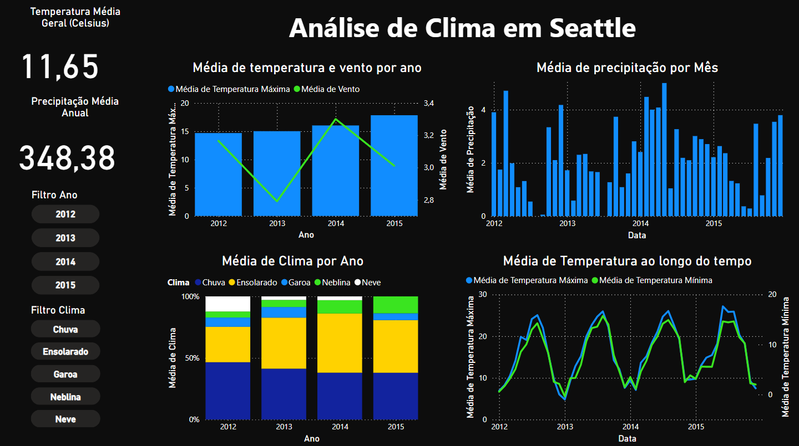

# Análise de Dados Climáticos de Seattle

## Descrição
Este projeto utiliza Power BI para criar um dashboard interativo que analisa dados climáticos de Seattle, com base no dataset "Seattle Weather". O preprocessamento foi feito com SQLite para agregar e otimizar os dados.

## Objetivo
Explorar padrões climáticos por meio de visualizações em diversos gráficos, com foco em fatores como temperatura, precipitação e tipos de clima ao longo do tempo, complementado por KPIs de desempenho.

## Fonte de Dados
- **Dataset**: "Seattle Weather" (Kaggle)  
- **Colunas usadas**: Data, Precipitação, Temperatura Máxima, Temperatura Mínima, Vento, Clima  

## Descrição da Utilização do Power BI
O dataset foi agregado via SQLite (veja `sql_documentation.md`) e carregado no Power BI. As visualizações incluem:  
1. **Colunas Agrupadas e Linha**: Temperatura Máxima e Vento por Ano  
2. **Colunas Agrupadas**: Precipitação por Mês  
3. **Colunas Empilhadas**: Clima por Ano  
4. **Linha**: Temperatura Máxima e Temperatura Mínima por Ano  

### KPIs Adicionados
- **Temperatura Média Geral**: Média das temperaturas máximas e mínimas ao longo do período.  
- **Precipitação Média Geral**: Média da precipitação anual.  
- **Filtro de Ano**: Permite visualizar dados por ano específico.  
- **Filtro de Clima**: Explora a influência dos tipos de clima nos gráficos e KPIs.  

## Captura de Tela

## Conclusão
O projeto revelou insights sobre variações sazonais de temperatura, precipitação e padrões de clima em Seattle, com KPIs oferecendo uma visão geral das condições climáticas.

---